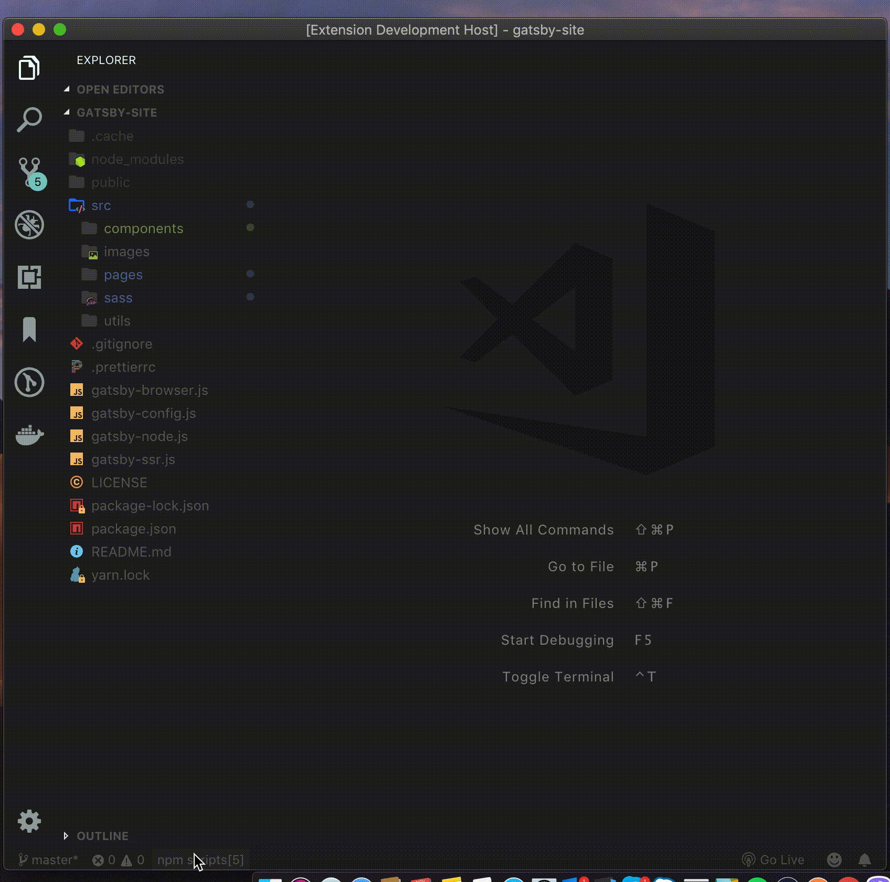
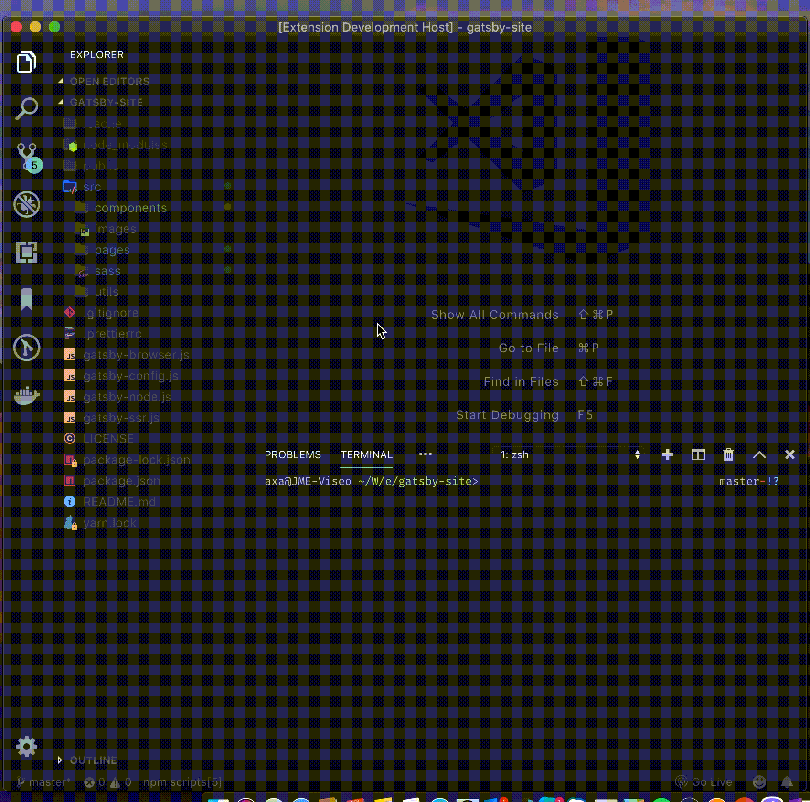

# npm-scripts

This small vscode extension lets you list and run immediately your npm scripts.

## Features

* Automatically track npm scripts in `package.json`
* Easy listing of npm scripts by just clicking the `npm scripts` in the statusbar or by executing the command `NPM Scripts`

By running the `NPM Scripts` command will display all npm scripts you have and let you choose what script to run. After choosing, it will open a terminal to run your chosen script.

## Usages

## Requirements

* Only works for codings that utilizes npm scripts in `package.json`

## Known Issues

Help me make this plugin worth to install by submitting issues for any bug you may found or suggestion you want to add.

## Release Notes

### 1.0.0

Initial release

* Automatically tracks npm scripts
* Allow user to run chosen npm scripts
